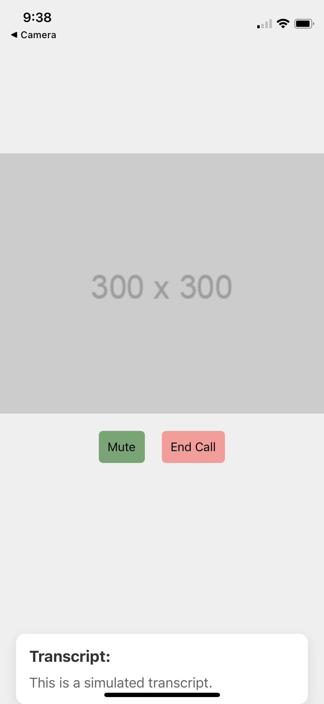

# Video-Call-App

## Overview

This mobile application provides a simplified video calling interface with basic features and simulates AI/ML-based real-time transcript generation. Developed using React Native and Expo, this app demonstrates core functionalities for video calling and basic AI/ML integration.

<p align="center">
  
  
</p>

When "Join Call" is pressed on the homescreen, the call screen is opened. A placeholder for camera input is shown with buttons for muting and ending the call. When 'mute' is clicked, the button changes to 'unmute.' When 'end call' is clicked, the call is ended, returning the the homescreen. The transcript at the bottom displays predefined placeholder text.

## Features

### Video Calling Screen
- **Video Stream**: Displays a placeholder for a participant's video stream.
- **Mute/Unmute**: Users can toggle audio muting/unmuting during the call.
- **End Call**: A button to end the video call.

### Integration with Google Meet
- **Simulated Join**: Users can simulate joining a video call room. This feature is designed to demonstrate the intended integration with Google Meet but does not perform actual authentication or backend interaction.

### AI/ML Solution - Real-time Transcript Generation
- **Simulated Transcript**: Displays placeholder text as a simulated transcript of the video call. This feature illustrates how real-time transcription might be integrated into the app.

## Installation

To set up and run the project locally:

1. **Clone the Repository:**

   ```bash
   git clone https://github.com/yourusername/video-call-app.git
   cd video-call-app
2. **Install Dependencies**
    ```
    npm install
3. **Start the Development Server**
    ```
    npx expo start